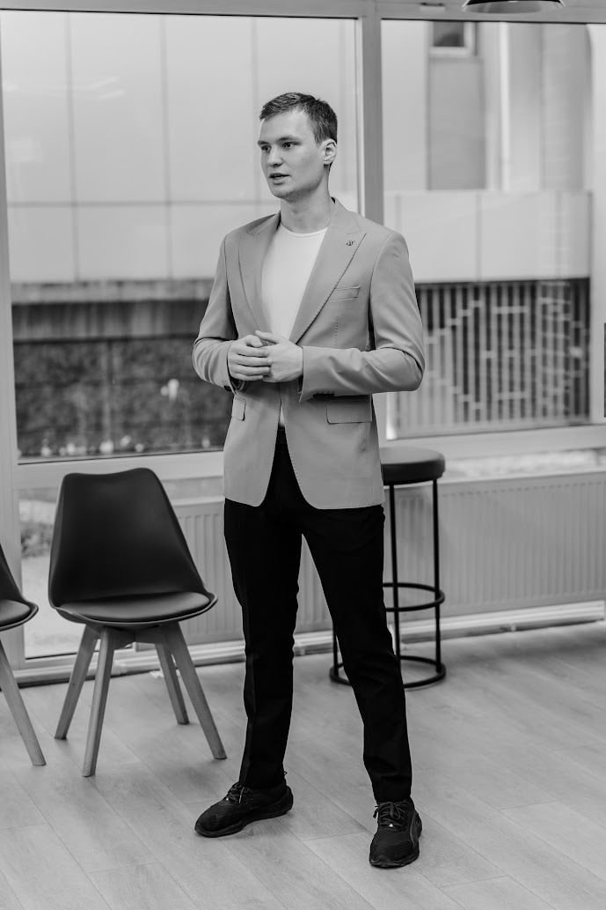

## Привет - привет! 👋

> _"I use NixOS btw"_

---

---

## Немного о себе

Я **Виктор Анисимов** (Victor Anisimov) - студент, изучающий то, что надо и не надо, ради своего счастья.

## Области интересов

Немного математики, настольные игры, спорт, немного чтения, написание не идельного кода.

## Языки програмирования и технологии

### Знаю(не полностью)

 - C++
 - Java
 - SQL
   
### Изучаю

 - Python
 - Elixir
   
### Планирую изучать

 - Assembler
 - Elixir

 ## Контактные данные

 - Telegram `@ViteaRU`
 - Gmail `teamogurcic6002@gmail.com`
